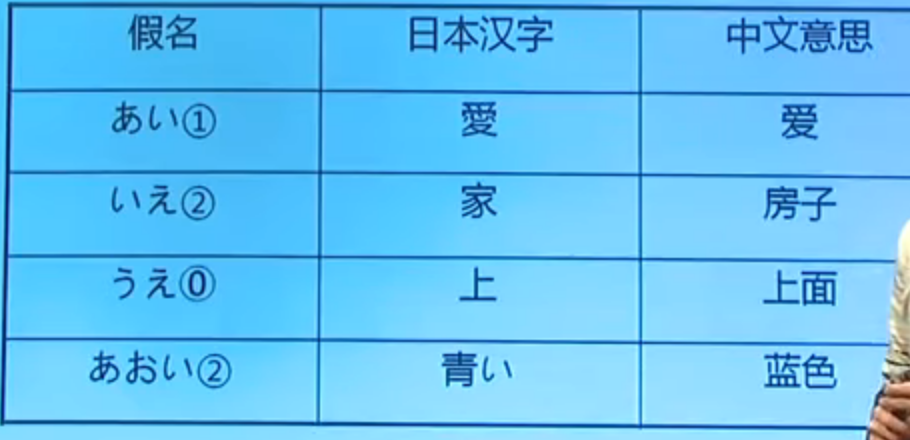

# 02 五十音图

URL: https://www.youtube.com/watch?v=8iWNqPrv2cY&list=PLrC1PicEF3XOpWmj53SqUnrQQCcIsd6hE

## 五十音图

五十音图 （日语发音：gou jiao ao mu zi）


平/片假名（46个）
横向：行（10行）
纵向：段（5段）

第1行元音（5个）  
第2~10行：辅+元


平假名的写法是比较圆润的，片假名的写法是比较方块的。  
平假名的主要作用是作为日本汉字的发音的。  （“日本”两字，日文写就是`にほん`，发音：ni hong。）  
片假名的主要作用是用来书写外来词，例如，一些地名、人名、流行词汇。

## ぁ 行

<font size="20">ぁ ぃ ぅ ぇ ぉ</font>


初记：ぁ ぃ studio = 我爱你  

日文：爱してる

在日语中，有这么一个万能神句「好（す）きです！」意思是“我喜欢你。”除了这句话，我想大多小伙伴们都还会想起“阿姨洗铁路”，也就是日语中用以表示“我爱你”的「爱（あい）してる」。

爱してる(ai shi te ru)就是常说的 “阿姨洗铁路”动漫中最常见的一种。


<font size="20">ぁ ぃ ぅ ぇ ぉ</font>


练习：正读、逆读、正逆连读、点读



| 假名 | 日本汉字 | 中文意思 |
|:---:|:---:|:---:|
| あい1 | 愛 | 爱 |
| いえ2 | 家 | 房子 |
| うえ0 | 上 | 上面 |
| あおい2 | 青い | 蓝色 |


0/1/2是音调(重音)

- 0调：是升调
- 1调：头高尾低，也就是降调。  
- 2调：第1个音在上面，第2个音在下面，重读音在第2个；如果有第3个假名，就应该读下来。2调是一个“低高低”的音调

## か 行

<font size="20">か き く け こ</font>


| 假名 | 日本汉字 | 中文意思 |
|:---:|:---:|:---:|
| ぁか1 | 赤 | 红色 |
| ぁき1 | 秋 | 秋天 |
| かき0 | 柿 | 柿子 |
| きく2 | 菊 | 菊花 |
| ぃけ2 | 池 | 水池 |
| こぃ1 | 恋 | 恋爱 |

赤丸: あかまる  
大蛇丸: おろちまる  
  

## さ 行

<font size="20">さ し す せ そ</font>


和“西”读音是一样的。


和“思”读音是一样的。


| 假名 | 日本汉字 | 中文意思 |
|:---:|:---:|:---:|
| さけ0 | 酒 | 酒 |
| しき2 | 四季 | 四季 |
| すし1 | 寿司 | 寿司 |
| あせ1 | 汗 | 汗 |
| うそ1 | 嘘 | 谎言 |


## た 行

<font size="20">た ち つ て と</font>


和“七”发音一样

大蛇丸: おろちまる 


和“磁”发音一样


| 假名 | 日本汉字 | 中文意思 |
|:---:|:---:|:---:|
| うた2 | 歌 | 歌 |
| した0 | 下 | 下面 |
| ちち2 | 父 | 父亲 |
| ちおてつ0 | 地下铁 | 地铁 |
| つき2 | 月 | 月亮 |
| そと1 | 外 | 外面 |


## な 行

URL: https://www.youtube.com/watch?v=8sscfi6zsqI&list=PLrC1PicEF3XOpWmj53SqUnrQQCcIsd6hE&index=5&pbjreload=10

<font size="20">な に ぬ ね の </font>


なに，就是经常听到的na ni，就是"什么"的意思


ね，是一个使用频率最高的语气助词，例如ka wa yi ne


助词，相当于中文的“的”字。


| 假名 | 日本汉字 | 中文意思 |
|:---:|:---:|:---:|
| なつ2 | 夏 | 夏天 |
| にし0 | 西 | 西 |
| いぬ2 | 犬 | 狗狗 |
| ねこ1 | 猫 | 猫咪 |
| あに1 | 兄 | 哥哥 |
| あね0 | 姉 | 姐姐 |
| つの | 角 | 角、触角 |


犬夜叉：いぬやしゃ  yi nu ya xia 

## は 行

<font size="20">は ひ ふ へ ほ</font>


富士山 hu ji sang


## ま 行

<font size="20">ま み む め も</font>

URL: https://www.youtube.com/watch?v=sGU_kkvGMBo&index=4&list=PLrC1PicEF3XOpWmj53SqUnrQQCcIsd6hE


もも 桃 mo mo
ももたろう 桃太郎（读音“摸摸他姥” mo mo ta ro）


## ゃ行

<font size="20">ゃ    ゅ    ょ</font>

URL: https://www.youtube.com/watch?v=1n_lbAGexNU&index=3&list=PLrC1PicEF3XOpWmj53SqUnrQQCcIsd6hE


读“优”


读“邀”


## ら行
<font size="20">ら り る れ ろ</font>


这里就是a li ga dao里的li


## わ 行

<font size="20">わ         を</font>


它在日语中是一个助词，宾语助词


## 拨音ん


它不可以单独使用，它一定要放在某个假名的后面。


ぁ ぃ ぅ ぇ ぉ  
か き く け こ k  
さ し す せ そ s  
た ち つ て と t   
な に ぬ ね の n  
は ひ ふ へ ほ h  
ま み む め も m   
ゃ    ゅ    ょ y  
ら り る れ ろ r  
わ         を w  
ん

```txt
ma mi mu me mo
ま み む め も  
```
记忆法：
- も：由它的中文原字“毛”很好记忆
- ま：有两种记法，第一种是“ま”和“も”很相似，第二种方法是用它的中文原字“末”
- み：它的中文原字是“美”，看起来很不像
- む：它的中文原字是“武”，形状上有点相似，但发音中不是wu，而是mu
- め：它的中文原字是“女”，读音是me，它和ぬ(nu)写法有点像。很奇怪的一点“美”读成mi，“女”读成me。

```txt
ya    yu    yo
ゃ    ゅ    ょ
```

记忆法：
- ゃ：它的中文原字是“也”，发音成ya也能接受。
- ゅ：它的中文原字是“由”，发音也和“由”相同
- ょ：它的中文原字是“与”，发音和“邀”相同

```txt
ra ri ru re ro
ら り る れ ろ
```
记忆法：
- ら：它的中文原字是“良”字，读“拉”，和“ち”（读“其”）长的相似。さくら 樱花（《火影》里的小樱）
- り：它的中文原字是“利”，ありがとう 谢谢（a li ga tao u)
- る：它的中文原字是“留”，读“撸”，外形和“ろ”相似。“留”到“撸”，“吕”到“捞”。
- れ：它的中文原字是“礼”，读“来”，外形和“ね”ne相似
- ろ：它的中文原字是“吕”，读“捞”，外形和“る”相似。“留”到“撸”，“吕”到“捞”。

关于“谢谢”：
- 谢谢：ありがとう（a li ga tao u)　
- 比较尊敬的时候：ありがとうございます（a li ga tao u go za i ma su)　

推荐电影：我与狗狗的十个约定 中日字幕 听说很好看

```txt
ゃくそく | ya ku so ku 约束（日文）-->约定（中文）
ゃく --> 约
そく --> 束
```

```txt
wa         o
わ         を
```

- わ：读“哇”
    - わたし 私（日本汉字）我（中文意思）
    - かわ   川（日本汉字）河（中文意思）
    - かわいい 可爱い （かわいい）读“卡哇伊” ▲用法: 日本人非常喜欢用[かわいい]这个词，身边的东西似乎全都[かわいい]，[かわいい]主要用于小巧的东西。

```txt
大蛇丸: おろちまる
自来也的日文发音是“じらいや”（Jiraiya）
宇智波鼬（うちはイタチ，Uchiha Itachi）
山中井野（山中いの，Yamanaka Ino）
漩渦鳴人（うずまきナルト，Uzumaki Naruto） 
```


练习：正读、逆读、正逆连读、点读

总结容易出错的几个发音：http://v0040395.11031.30la.com.cn/?Article113/135.html

- あ行：注意`う`的发音，和咱们发音u有些差别，不用把嘴翘起来，平平的发就可以了。
- か行：`く`也是和`う`一样，千万别读成哭哦。
- さ行：日语里没有翘舌音，所以发`し`、`す`的时候特别注意，`し`读起来比较像xi，虽然罗马音标注是shi。
- た行：ち罗马音标注是chi，因为日语里木有卷舌音，所以读起来会比较像qi。
- は行：ふ的发音介于fu和hu之间，这个读熟了就习惯了，不需要特别刻意。
- ら行：罗马音标注是r，其实r发l的音，ra、ri、ru、re、ro读起来就是la、li、lu、le、lo。

日语输入法方面常见的一些小问题：

を打wo就出来了，虽然它的发音是o，输入上要打wo才能出来。
ん双打n才能出来。

| 假名 | 日本汉字 | 中文意思 | 扩展 |
|:---:|:---:|:---:|:---|
| ぃぬ | 犬 | 狗狗 | いぬやしゃ 犬夜叉 yi nu ya xia |
| ぁに1 | 兄 | 哥哥 | 《火影忍者》中佐助叫鼬a ni sang |
| ぁね0 | 姉 | 姐姐 | 《犬夜叉》中琥珀叫珊瑚a ne wei | 

求人详解 お兄（にい）さん 和 兄贵（あにき） 的不同之处。

- 第一个是普通尊称 
- 第二个有小到大，下到上的仰视，尊敬又觉得值得依靠的哥哥的意思

00:21:50

ぁぃ studio ： 我爱你

NARUTO ガイ名言 URL:https://www.youtube.com/watch?v=uSnbbK8Dj3M
```txt
自分を信じない奴になんかに、努力する価値は無い!!!
```

汉字词的意思，就是通常由汉字书写，并且是汉字当中本来就有的单词，而且是汉字识意，不需要猜的词。

固有词，日语当中本来就有的词，有可能是汉字，也有可能是汉字和假名的组合，或者全部是假名的词。


## 第一人称：我

URL: https://www.youtube.com/watch?v=i7k1_UkE5Wg

男生（我）：
- ゎたし/watashi 哇达西（比较有礼貌，正式场合，见上司，第一次见面）
- /boku 距离比较近（日本男生5岁的时候第一个学会的“我”），也有可能让人觉得长不大，像个小孩子，也就是所谓的“妈宝”。
- ぉ/ore 最粗俗的讲法，但也是最有男人气概的感觉。女友最爱男友使用。但刚见面不久，会让人觉得大男人，自我主张很强。

女生的第一人称（我）是看自己的角色来使用

- ゎたし/watashi 哇达西（也是最有礼貌的讲法）
- ぁたし/atashi 啊达西（是“哇达西”的懒惰版），比较随和，女生、大人都会用
- ぅち/uchi 乌七 有家的感觉，年轻人可以用，否则可能让人觉得装可爱
- ゎたくし/watakushi 哇达苦西（在会议的发表演讲的时候）
- /jibun  鸡奔（自分，男女通用，客观的叫自己） 
- ゎし/washi 哇西（一般老爷爷会使用的印象）
