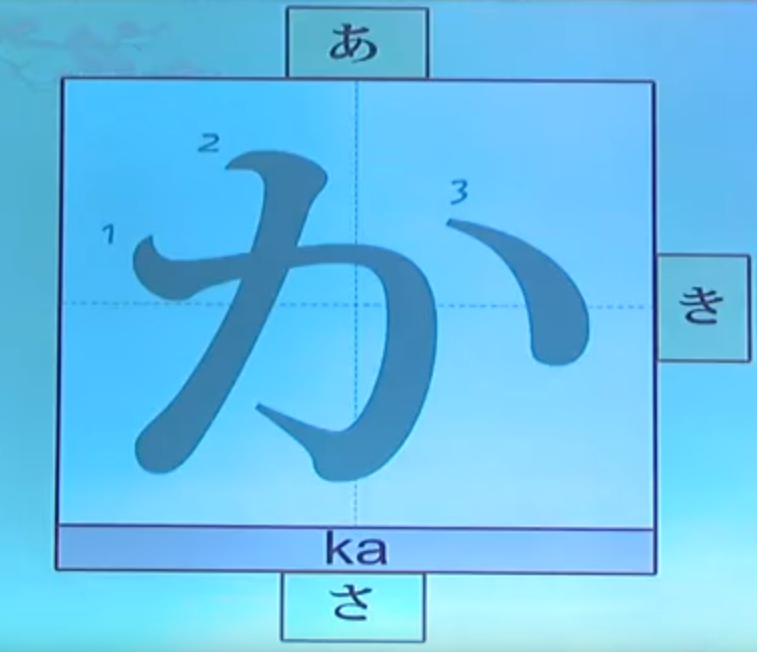

# 02 五十音图

URL: https://www.youtube.com/watch?v=8iWNqPrv2cY&list=PLrC1PicEF3XOpWmj53SqUnrQQCcIsd6hE

## 五十音图

五十音图 （日语发音：gou jiao ao mu zi）

平/片假名（46个）
横向：行（10行）
纵向：段（5段）

第1行元音（5个）  
第2~10行：辅+元

平假名的写法是比较圆润的，片假名的写法是比较方块的。  
平假名的主要作用是作为日本汉字的发音的。  （日本，日语发音：ni hong）  
片假名的主要作用是用来书写外来词，例如，一些地名、人名、流行词汇。

## ぁ 行

ぁ ぃ ぅ ぇ ぉ

ぁ ぃ studio = 我爱你

ぁ ぃ ぅ ぇ ぉ

练习：正读、逆读、正逆连读、点读

0/1/2是音调(重音)

1调：头高尾低，也就是降调。  
2调：第1个音在上面，第2个音在下面，重读音在第2个；如果有第3个假名，就应该读下来。2调是一个“低高低”的音调

## か 行

か き く け こ

赤丸: あかまる  
大蛇丸: おろちまる  

ぁか1：赤  
ぁき1：秋  
かき0：柿  
きく2：菊  
ぃけ2：池  
こぃ1：恋  

ぁ ぃ ぅ ぇ ぉ
か き く け こ
さ し す せ そ
た ち つ っ てとゐ
なにぬねのはひふへへほほゑ
まみむめもゃゅょゎを

练习：正读、逆读、正逆连读、点读

00:21:50

ぁぃ studio ： 我爱你

汉字词的意思，就是通常由汉字书写，并且是汉字当中本来就有的单词，而且是汉字识意，不需要猜的词。

固有词，日语当中本来就有的词，有可能是汉字，也有可能是汉字和假名的组合，或者全部是假名的词。

00:27:46 第2行

00:40:23 第3行

